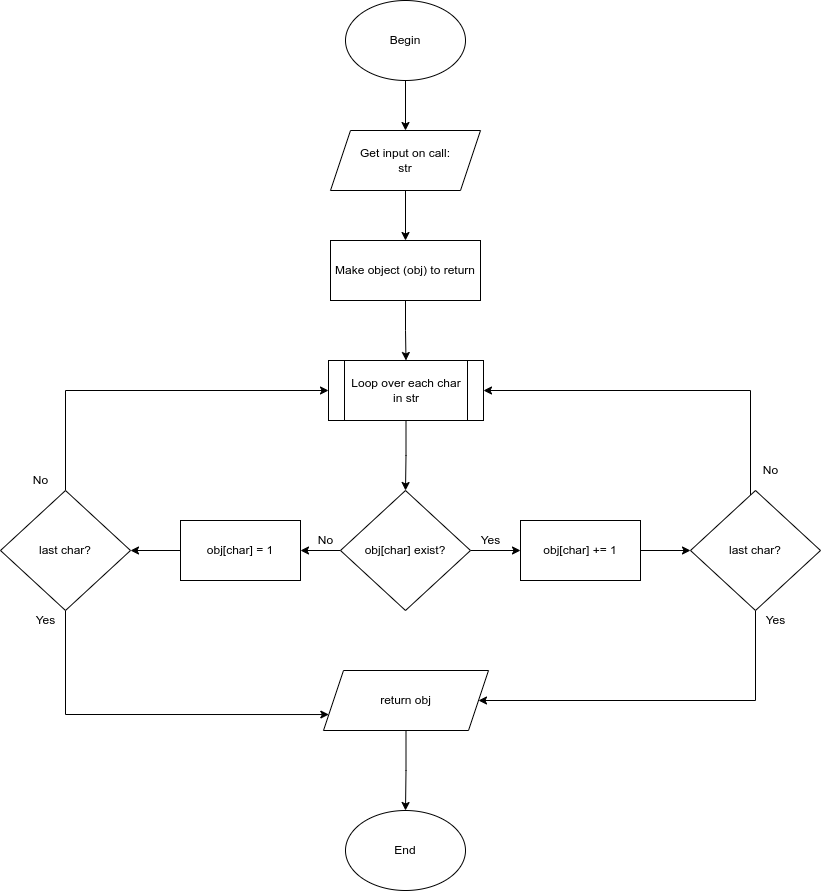
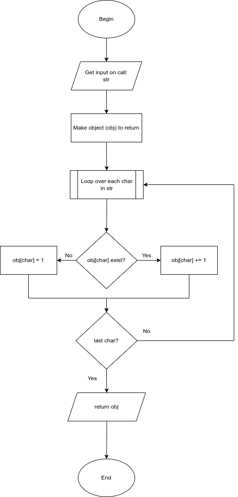

<h2>Section 4: Problem Solving Approach</h2>

<h3>Introduction</h3>

<b>Algorithm:</b>  process or set of steps to accomplish a certain task.

Everything in programming requires some sort of algorithm.

Algorithms come up a lot in interview settings.

<h5>How to improve</h5>

<ol style="list-style-type: lower-alpha">
<li>Devise plan for solving problems.</li>
<li>Master common problem solving patterns.</li>
</ol>

<h5>Five Steps</h5>
<ol>
<li>Understand the problem</li>
<li>Explore concrete examples</li>
<li>Break it down</li>
<li>Solve or simplify</li>
<li>Look back and refactor</li>
</ol>

<h4>1. Understand the problem</h4>

<ol style="list-style-type:upper-alpha">
<li>Can I restate the problem in my own words?</li>
<li>What are the inputs for the problem?</li>
<li>What outputs should the solution provide?</li>
<li>Can the outputs be determined by the inputs?<ul><li>Is there enough information to solve the problem?</li><li>No solution possible is an okay solution.</li><li>Especially important early in solving.</li></ul></li>
</ol>

<h4>2. Explore concrete examples</h4>

<ol class="upperAlpha">
<li>Examples help you understand the program.</li>
<li>Examples offer practice in identifying patterns.</li>
<li>Can also provide sanity checks for your eventual solution.</li>
<li>Steps<ol><li>Start with simple examples.</li><li>Progress to more complex examples.</li><li>Explore examples with empty inputs</li><li>Explore examples with invalid inputs</li></ol></li>
</ol>

<h4>3. Break it down</h4>

<ol class="upperAlpha">
<li>Write down the steps for the solution in words.</li>
<li>Think about the code you will write - before you write it.</li>
<li>Be careful to catch conceptual issues or misunderstandings.</li>
<li>Don't be concerned with coding language or syntax.</li>
<li>Carefully written steps should define the logical flow of code (pseudo code)</li>
<li>After steps in writing: <ul><li>Use logical tools like flow charts or UML diagrams.</li></ul></li>
</ol>

<h5>Sample Flow Chart</h5>

Problem:  Given a string, return an object with a count of each character in the string.

<h4>4. Solve or simplify</h4>

<ol class="upperAlpha">
    <li>Take focus off the hardest part for a minute.</li>
    <li>Make sure the simpler part is complete.</li>
    <li>Make sure the logic written is efficient.</li>
    <li>Simplify if possible.</li>
</ol>

<h5>Revised flow chart</h5>

Reuse existing logic instead of repeating separately.

<h4>5. Look back and refactor</h4>

<ol class="upperAlpha">
<li>Strive for high goals in your work.</li>
<li>Be willing to go back and reflect.</li>
<li>What do you like?  Don't like?</li>
<li>Consider these refactoring questions:
<ol>
<li>Can you check the result?</li>
<li>Can you derive the result differently?</li>
<li>Can you understand it at a glance?</li>
<li>Can you use the result or method for some other problem?</li>
<li>Can you improve the performance of your solution?</li>
<li>Can you think of other ways to refactor?</li>
<li>How have others solved this problem?</li>
</ol></li>
</ol>

See charCount.js in this folder for a streamlined version of coding for the char count exercise.

<h3>References</h3>
George Polya, How to Solve It: A New Aspect of Mathematical Method, <a href="https://www.amazon.com/dp/069111966X?psc=1&smid=A2IJ2SEB4JT1EX&ref_=chk_typ_imgToDp">On Amazon</a>
